# Crypto Regime & Strategy Validation Report

Pinned research window: `2018-01-01T00:00:00Z` to `2026-07-28T00:00:00Z` (exclusive). Generated from committed artifacts. Synthetic data used: **False**.

> This is historical research, not investment advice, a proven trading edge, or authorization for paper/live execution. A completed backtest means the code ran against the documented data under the documented assumptions; it does not establish future profitability.

## Validation status

| strategy | status | validated_coin_count | evidence | claim_boundary |
| --- | --- | --- | --- | --- |
| breakout | historical_backtest_completed | 10 | real Binance candles/funding plus committed trades, returns, and metrics | research backtest, not a proven edge or live-trading approval |
| contrarian | historical_backtest_completed | 10 | real Binance candles/funding plus committed trades, returns, and metrics | research backtest, not a proven edge or live-trading approval |
| dca | historical_backtest_completed | 10 | real Binance candles/funding plus committed trades, returns, and metrics | research backtest, not a proven edge or live-trading approval |
| funding_arbitrage | historical_backtest_completed | 10 | real Binance candles/funding plus committed trades, returns, and metrics | research backtest, not a proven edge or live-trading approval |
| grid | historical_backtest_completed | 10 | real Binance candles/funding plus committed trades, returns, and metrics | research backtest, not a proven edge or live-trading approval |
| market_making | not_validated_missing_historical_order_book_and_fills | 0 | specification only; historical order-book and fill evidence absent | research backtest, not a proven edge or live-trading approval |
| mean_reversion | historical_backtest_completed | 10 | real Binance candles/funding plus committed trades, returns, and metrics | research backtest, not a proven edge or live-trading approval |
| momentum | historical_backtest_completed | 10 | real Binance candles/funding plus committed trades, returns, and metrics | research backtest, not a proven edge or live-trading approval |
| statistical_arbitrage | historical_backtest_completed | 10 | real Binance candles/funding plus committed trades, returns, and metrics | research backtest, not a proven edge or live-trading approval |
| trend_following | historical_backtest_completed | 10 | real Binance candles/funding plus committed trades, returns, and metrics | research backtest, not a proven edge or live-trading approval |

Market making is deliberately not scored: candles cannot establish executable two-sided fills, queue position, adverse selection, or hedging performance. Funding arbitrage uses real funding observations, but remains preliminary because borrow, basis drift, margin, liquidation, and venue-specific execution are not modeled.

## Data sources and exact coverage

All inputs came from Binance public spot OHLCV and USD-M funding endpoints. MATIC and POL are preserved as separate source symbols around Binance's migration; no missing candles were fabricated. Every committed compressed CSV has a SHA-256 digest below.

| coin | timeframe | kind | source_symbols | first_timestamp | last_timestamp | rows | sha256 |
| --- | --- | --- | --- | --- | --- | --- | --- |
| ADA | 8h | perpetual_funding | ADAUSDT | 2020-01-19T16:00:00+00:00 | 2026-07-27T16:00:00.001000+00:00 | 7144 | dbbb834e58da3fccec91ef540177df9643c4bb41fedf5f566cd556cf2ca9f2c1 |
| AVAX | 8h | perpetual_funding | AVAXUSDT | 2020-09-22T16:00:00.004000+00:00 | 2026-07-27T16:00:00.001000+00:00 | 6403 | 97a0f3b480b10ecec2555137cf137b8bf5d1264ecb7b5e9dc167195def213cae |
| BNB | 8h | perpetual_funding | BNBUSDT | 2020-02-10T08:00:00+00:00 | 2026-07-27T16:00:00.001000+00:00 | 7079 | 7a95b8740597aebbbf0d3857696c9f8374a8c53e3934e8f5797df0e98a3de405 |
| BTC | 8h | perpetual_funding | BTCUSDT | 2019-09-10T08:00:00+00:00 | 2026-07-27T16:00:00.001000+00:00 | 7538 | a7c3843751c865955dcbc40d0af2b0985fe4f222903509123e522117397d98b6 |
| DOGE | 8h | perpetual_funding | DOGEUSDT | 2020-07-10T08:00:00.001000+00:00 | 2026-07-27T16:00:00.001000+00:00 | 6626 | 4808282466cbd09303ba24bfa6f9e41bad8fe239cca3882751666de2211648be |
| ETH | 8h | perpetual_funding | ETHUSDT | 2019-11-27T08:00:00+00:00 | 2026-07-27T16:00:00.001000+00:00 | 7304 | 8abe144cad344a8e892de45472367101686f2928755912de1ab85f79dc68d2d3 |
| LINK | 8h | perpetual_funding | LINKUSDT | 2020-01-17T08:00:00+00:00 | 2026-07-27T16:00:00.001000+00:00 | 7151 | cc8a0b0bfbf9278e65eb504455b60ef0aa689a4075eb2b985659f4774141e93a |
| POL | 8h | perpetual_funding | MATICUSDT;POLUSDT | 2020-10-22T08:00:00+00:00 | 2026-07-27T20:00:00.004000+00:00 | 8352 | e477fed5b13ebd46c05b4affe8357efd75db2aa7e9909acba7e55c816850431a |
| SOL | 8h | perpetual_funding | SOLUSDT | 2020-09-13T16:00:00.004000+00:00 | 2026-07-27T16:00:00.001000+00:00 | 6505 | 8647daaefeb6aeb60df38926371f4097dba33be3dd65be9c5fcd14acb3c8ee09 |
| XRP | 8h | perpetual_funding | XRPUSDT | 2020-01-06T08:00:00+00:00 | 2026-07-27T16:00:00.001000+00:00 | 7184 | 5bbb2f70c42add98d2805a6e53e28b37d54b077261e5d8bfebae18e3f4c5884c |
| ADA | 1d | spot_ohlcv | ADAUSDT | 2018-04-17T00:00:00+00:00 | 2026-07-27T00:00:00+00:00 | 3024 | 78e102a1cab8827c3674832c8c58c6b13b6043b3c27468d215b0038ede40c18e |
| ADA | 1h | spot_ohlcv | ADAUSDT | 2018-04-17T04:00:00+00:00 | 2026-07-27T23:00:00+00:00 | 72484 | bbd68812f14034a6d24da08223b9b80498a4de1587950a7a3ddeb43486c144f4 |
| ADA | 4h | spot_ohlcv | ADAUSDT | 2018-04-17T04:00:00+00:00 | 2026-07-27T20:00:00+00:00 | 18134 | 54aede37d089be626d393c5a90653928f48c28437b988387b8a74c453b1cdcee |
| AVAX | 1d | spot_ohlcv | AVAXUSDT | 2020-09-22T00:00:00+00:00 | 2026-07-27T00:00:00+00:00 | 2135 | 03dbbfefbae4eacbea71ebe0e1809424057bd236715cbce0fa3ad8a6430f0068 |
| AVAX | 1h | spot_ohlcv | AVAXUSDT | 2020-09-22T06:00:00+00:00 | 2026-07-27T23:00:00+00:00 | 51214 | 7afe0b9394e16a78f326a0879118afe082498d336fa60effbe6cb338a1bba825 |
| AVAX | 4h | spot_ohlcv | AVAXUSDT | 2020-09-22T04:00:00+00:00 | 2026-07-27T20:00:00+00:00 | 12809 | 5dc689b8b83c44a3bef93812c62919f865c6d1556743047bc8a40a32d843ae2d |
| BNB | 1d | spot_ohlcv | BNBUSDT | 2018-01-01T00:00:00+00:00 | 2026-07-27T00:00:00+00:00 | 3130 | 420c98d4c374f08e5b6aed9cfe8b13ad9723a0264a8e1707823e61328ff606de |
| BNB | 1h | spot_ohlcv | BNBUSDT | 2018-01-01T00:00:00+00:00 | 2026-07-27T23:00:00+00:00 | 74998 | d5271854db28f6b66b14a5fa29f7ca0fe3c76fb0ce9be364c98db96d0409ef88 |
| BNB | 4h | spot_ohlcv | BNBUSDT | 2018-01-01T00:00:00+00:00 | 2026-07-27T20:00:00+00:00 | 18764 | 91702306cdd9e901132f33037f0e809739e55a5e8b7414de2bba667f1ebde826 |
| BTC | 1d | spot_ohlcv | BTCUSDT | 2018-01-01T00:00:00+00:00 | 2026-07-27T00:00:00+00:00 | 3130 | 663af61952561de58c1bfe8ebcbef5827eeff1673424f7a65ec40863d6811da0 |
| BTC | 1h | spot_ohlcv | BTCUSDT | 2018-01-01T00:00:00+00:00 | 2026-07-27T23:00:00+00:00 | 74998 | 8c594e1fb43e69088efd8d5980ae7e6db1e3d7dba7f943bde82ba54f008eeadc |
| BTC | 4h | spot_ohlcv | BTCUSDT | 2018-01-01T00:00:00+00:00 | 2026-07-27T20:00:00+00:00 | 18764 | c06bb236b9a99b26e26895e8057440dc0ac79c7d78a07003133a35b319099073 |
| DOGE | 1d | spot_ohlcv | DOGEUSDT | 2019-07-05T00:00:00+00:00 | 2026-07-27T00:00:00+00:00 | 2580 | 47e4a71891b8d14c356539587bd1eff15b304e8946615f772c8fa2695c024c14 |
| DOGE | 1h | spot_ohlcv | DOGEUSDT | 2019-07-05T12:00:00+00:00 | 2026-07-27T23:00:00+00:00 | 61864 | 48503ad3dc7313140f648b9091a7cabe9d9c71a8769a9d5154c08b1552c822c8 |
| DOGE | 4h | spot_ohlcv | DOGEUSDT | 2019-07-05T12:00:00+00:00 | 2026-07-27T20:00:00+00:00 | 15475 | 2efac03e18a4b85f1f75c5a5c316209414b4e261a25aa7a2e65b07e7375cb9a2 |
| ETH | 1d | spot_ohlcv | ETHUSDT | 2018-01-01T00:00:00+00:00 | 2026-07-27T00:00:00+00:00 | 3130 | 8b330b99309678d15195967823bc528776ae3aa46bc96ce14afdc7f89f3867dd |
| ETH | 1h | spot_ohlcv | ETHUSDT | 2018-01-01T00:00:00+00:00 | 2026-07-27T23:00:00+00:00 | 74998 | 2de408f963ab72324e508830740f1477818d8c80417b33bbdd4cd4889f221058 |
| ETH | 4h | spot_ohlcv | ETHUSDT | 2018-01-01T00:00:00+00:00 | 2026-07-27T20:00:00+00:00 | 18764 | 40e8b10de32c8c8ea8b6e06cab35e99d590b926c3c4848a423d6c12c7eda964d |
| LINK | 1d | spot_ohlcv | LINKUSDT | 2019-01-16T00:00:00+00:00 | 2026-07-27T00:00:00+00:00 | 2750 | 82ca414b23d6f22cdf1f90af8f05731f2b7cc03456cfde2586d01f3b1483e83e |
| LINK | 1h | spot_ohlcv | LINKUSDT | 2019-01-16T10:00:00+00:00 | 2026-07-27T23:00:00+00:00 | 65930 | e7fd0c7246e0856e5ac254d9d3fe06a6444ce607f9494f019013d17f8e109c12 |
| LINK | 4h | spot_ohlcv | LINKUSDT | 2019-01-16T08:00:00+00:00 | 2026-07-27T20:00:00+00:00 | 16493 | 852e49d9515ee1b25dcaf22d617ea4632203dfe161b43cf6cf18a73cba82ce48 |
| POL | 1d | spot_ohlcv | MATICUSDT;POLUSDT | 2019-04-26T00:00:00+00:00 | 2026-07-27T00:00:00+00:00 | 2648 | 574b6c4aed88269d6f2531c0e35a499522b7d9dc6e41909eeee5128de8929719 |
| POL | 1h | spot_ohlcv | MATICUSDT;POLUSDT | 2019-04-26T15:00:00+00:00 | 2026-07-27T23:00:00+00:00 | 63452 | df8ead557b50d30e5e42d57138cf6d61186237b7bb79a8433e0d6d708b038f0f |
| POL | 4h | spot_ohlcv | MATICUSDT;POLUSDT | 2019-04-26T12:00:00+00:00 | 2026-07-27T20:00:00+00:00 | 15874 | 9f4458973c2fd88663211cd01a5cdcf83f640727627053840b902161e7b9dd66 |
| SOL | 1d | spot_ohlcv | SOLUSDT | 2020-08-11T00:00:00+00:00 | 2026-07-27T00:00:00+00:00 | 2177 | c4d79f93226994da402cbb61fc6935501c084bdfbcd106ff22b0b9693d031467 |
| SOL | 1h | spot_ohlcv | SOLUSDT | 2020-08-11T06:00:00+00:00 | 2026-07-27T23:00:00+00:00 | 52222 | 1ca418b22b2ff84376a7d38b7b3e8e0a9578e2351b176ebcc9f6c33058f6a694 |
| SOL | 4h | spot_ohlcv | SOLUSDT | 2020-08-11T04:00:00+00:00 | 2026-07-27T20:00:00+00:00 | 13061 | 91bd3208c49a2c737a53fff9db981e0a33eca2a811647a9f5c5ee1ce0ad25bca |
| XRP | 1d | spot_ohlcv | XRPUSDT | 2018-05-04T00:00:00+00:00 | 2026-07-27T00:00:00+00:00 | 3007 | 30a33d4e18f22a8a212a14dbfa15b71a8986470c27e58d5319e56fe0ce75886e |
| XRP | 1h | spot_ohlcv | XRPUSDT | 2018-05-04T08:00:00+00:00 | 2026-07-27T23:00:00+00:00 | 72072 | 07f195a69b57bd66398d8c51c984bc72253778985d30c1a52d63d0011ccfa0a9 |
| XRP | 4h | spot_ohlcv | XRPUSDT | 2018-05-04T08:00:00+00:00 | 2026-07-27T20:00:00+00:00 | 18031 | 36f29afded7e37187568d66671d03ce3956007df497e636e6bf128393a9fd80d |

## Strategy × regime mean Sharpe

Sharpe values are conditional historical estimates averaged across available assets. Costs are charged at 0.10% fees plus 0.05% slippage per one-way position change.

| strategy | Crash/Capitulation | High Vol Expansion | Bull Trend | Bear Trend | Range/Chop |
| --- | --- | --- | --- | --- | --- |
| breakout | -2.9554 | -0.7334 | 0.4201 | 0.1161 | 0.3111 |
| contrarian | 1.0647 | -0.9493 | -0.7418 | 0.2637 | -0.4735 |
| dca | 2.7925 | 2.0397 | 1.5046 | 0.1366 | 0.3352 |
| funding_arbitrage | -5.0232 | -3.4103 | -3.0505 | -3.0488 | -2.8483 |
| grid | 1.7010 | -0.0974 | -1.5307 | -1.4312 | -1.2994 |
| mean_reversion | 2.8119 | -1.3736 | -1.8370 | -0.4718 | -1.1120 |
| momentum | 0.3763 | 1.6399 | 0.3648 | 0.0892 | -0.0638 |
| statistical_arbitrage | 0.1645 | -1.0941 | -0.4693 | -0.2494 | -0.1878 |
| trend_following | -2.4198 | 0.9899 | 0.6798 | 0.0039 | 0.3414 |

## Per-asset best historical strategy by regime

| coin | regime | strategy | sharpe | max_drawdown | total_return |
| --- | --- | --- | --- | --- | --- |
| ADA | Bear Trend | dca | 1.1035 | 0.5458 | 2.7612 |
| ADA | Bull Trend | dca | 0.6942 | 0.7122 | 0.2709 |
| ADA | Crash/Capitulation | mean_reversion | 3.1097 | 0.3423 | 0.6780 |
| ADA | High Vol Expansion | dca | 3.4882 | 0.3730 | 2.4847 |
| ADA | Range/Chop | trend_following | 1.3133 | 0.5772 | 23.5137 |
| AVAX | Bear Trend | momentum | 0.8195 | 0.1385 | 0.2117 |
| AVAX | Bull Trend | breakout | 1.5097 | 0.4993 | 0.8088 |
| AVAX | Crash/Capitulation | contrarian | 2.0827 | 0.0204 | 0.0450 |
| AVAX | High Vol Expansion | momentum | 4.0778 | 0.1209 | 0.6083 |
| AVAX | Range/Chop | statistical_arbitrage | 0.6479 | 0.4780 | 0.6955 |
| BNB | Bear Trend | breakout | 0.6783 | 0.3172 | 0.4092 |
| BNB | Bull Trend | dca | 2.2909 | 0.4487 | 12.4442 |
| BNB | Crash/Capitulation | dca | 3.6810 | 0.2337 | 0.6045 |
| BNB | High Vol Expansion | dca | 3.5547 | 0.3689 | 1.9872 |
| BNB | Range/Chop | trend_following | 0.3163 | 0.8616 | -0.0950 |
| BTC | Bear Trend | momentum | 0.8473 | 0.1513 | 0.2174 |
| BTC | Bull Trend | dca | 2.4281 | 0.2844 | 12.4310 |
| BTC | Crash/Capitulation | grid | 3.7897 | 0.0603 | 0.1941 |
| BTC | High Vol Expansion | momentum | 2.2798 | 0.0282 | 0.0414 |
| BTC | Range/Chop | momentum | 0.6383 | 0.2588 | 0.2628 |
| DOGE | Bear Trend | contrarian | 0.7864 | 0.0394 | 0.0835 |
| DOGE | Bull Trend | dca | 1.7722 | 0.6974 | 10.9393 |
| DOGE | Crash/Capitulation | mean_reversion | 6.9501 | 0.2570 | 2.1489 |
| DOGE | High Vol Expansion | dca | 1.4416 | 0.7205 | 0.6291 |
| DOGE | Range/Chop | dca | 0.5005 | 0.8460 | 0.2903 |
| ETH | Bear Trend | trend_following | 0.7004 | 0.5560 | 0.8481 |
| ETH | Bull Trend | trend_following | 1.7601 | 0.3395 | 4.2012 |
| ETH | Crash/Capitulation | momentum | 4.2474 | 0.0299 | 0.1408 |
| ETH | High Vol Expansion | momentum | 2.0091 | 0.0611 | 0.0616 |
| ETH | Range/Chop | dca | 1.1089 | 0.5179 | 6.2811 |
| LINK | Bear Trend | dca | 0.2913 | 0.6859 | -0.2450 |
| LINK | Bull Trend | dca | 1.0467 | 0.7389 | 1.2353 |
| LINK | Crash/Capitulation | dca | 7.5090 | 0.2363 | 2.8349 |
| LINK | High Vol Expansion | grid | 2.8528 | 0.2756 | 0.9202 |
| LINK | Range/Chop | dca | 0.4424 | 0.8498 | -0.1294 |
| POL | Bear Trend | trend_following | 0.5255 | 0.4979 | 0.2592 |
| POL | Bull Trend | trend_following | 1.1310 | 0.4759 | 1.1774 |
| POL | Crash/Capitulation | dca | 5.6703 | 0.3775 | 2.5621 |
| POL | High Vol Expansion | breakout | 2.6324 | 0.3757 | 1.7475 |
| POL | Range/Chop | breakout | 0.8681 | 0.6596 | 3.4079 |
| SOL | Bear Trend | breakout | 0.6851 | 0.5162 | 0.3339 |
| SOL | Bull Trend | dca | 2.4543 | 0.6186 | 10.3686 |
| SOL | Crash/Capitulation | funding_arbitrage | 10.4525 | 0.0123 | 0.2708 |
| SOL | High Vol Expansion | dca | 1.4482 | 0.4655 | 0.2901 |
| SOL | Range/Chop | dca | 0.3571 | 0.8403 | -0.0890 |
| XRP | Bear Trend | contrarian | 0.8125 | 0.0609 | 0.1469 |
| XRP | Bull Trend | dca | 1.0487 | 0.4431 | 1.1962 |
| XRP | Crash/Capitulation | grid | 5.2100 | 0.1757 | 0.7586 |
| XRP | High Vol Expansion | dca | 2.3431 | 0.6059 | 1.1148 |
| XRP | Range/Chop | dca | 0.2431 | 0.7399 | -0.4857 |

## Overall historical ranking

| strategy | sharpe |
| --- | --- |
| dca | 0.7014 |
| trend_following | 0.3361 |
| momentum | 0.1948 |
| breakout | 0.1769 |
| statistical_arbitrage | -0.3179 |
| contrarian | -0.3262 |
| mean_reversion | -0.9708 |
| grid | -1.0331 |
| funding_arbitrage | -2.6721 |

## Candidate regime-adaptive combinations

1. Crash/Capitulation: mean reversion + dca; High Vol Expansion: dca + momentum; Bull Trend: dca + trend following; Bear Trend: contrarian + dca; Range/Chop: trend following + dca
2. Diversify the first-ranked regime specialists with the lowest-correlated eligible strategy.
3. Use the top two per regime at half weight and require both to remain positive after doubled costs.

These combinations are hypotheses derived from the same sample, not holdout-validated recommendations. They must be subjected to purged walk-forward testing, a sealed holdout, trial accounting, and robustness tests before any paper phase.

## Charts

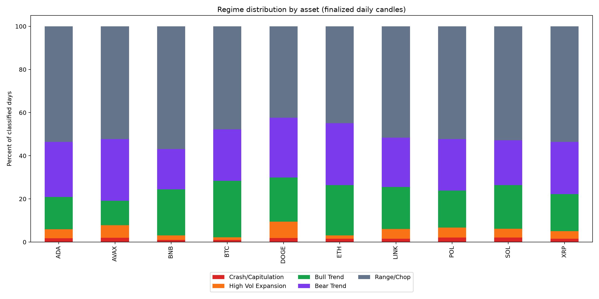

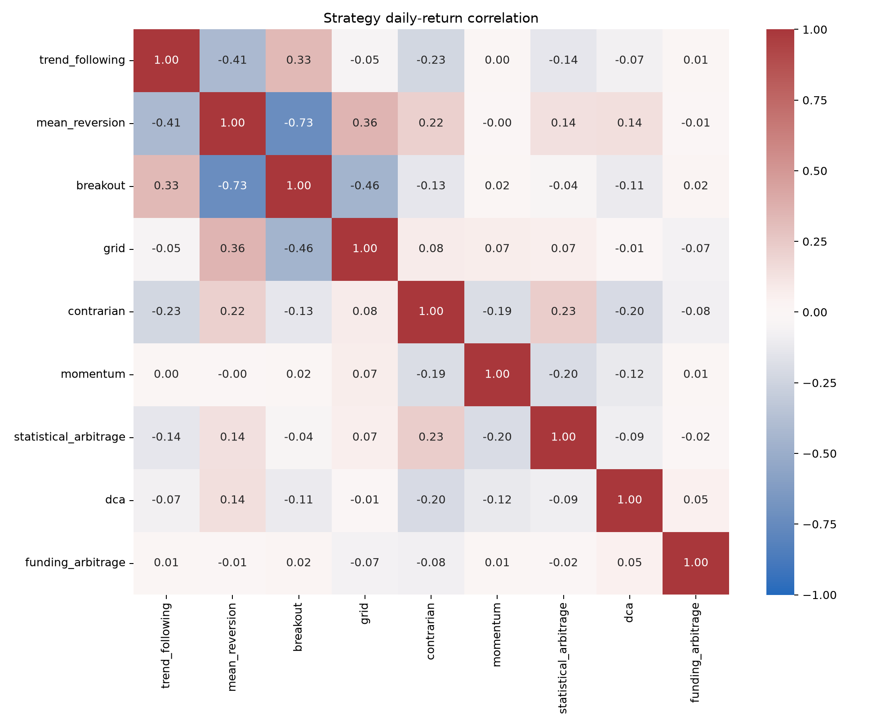

### Trend Following

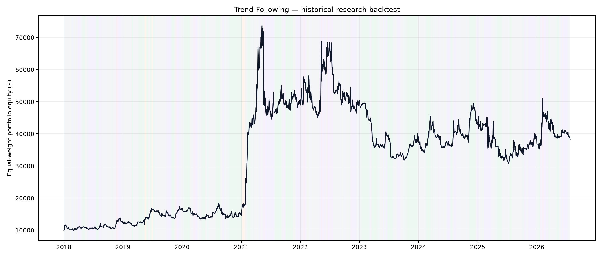

### Mean Reversion

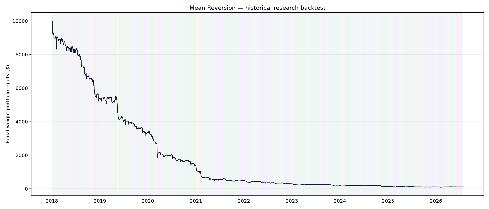

### Momentum

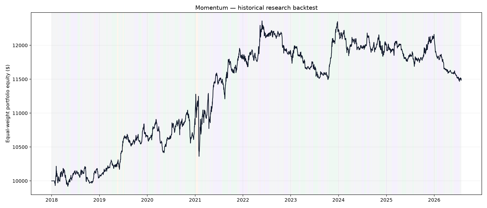

### Breakout

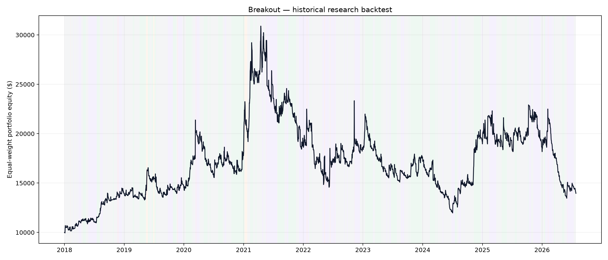

### Grid

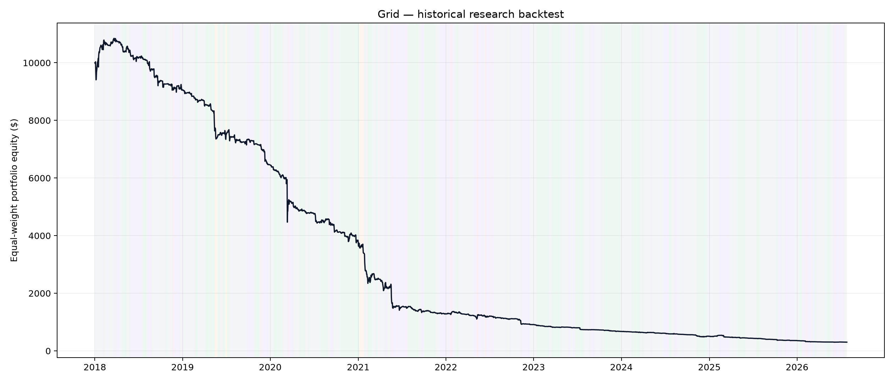

### Dca

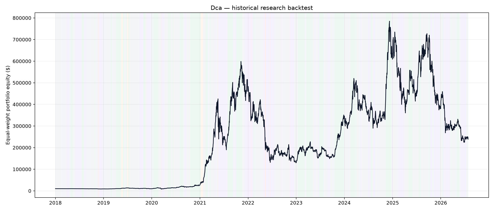

### Funding Arbitrage

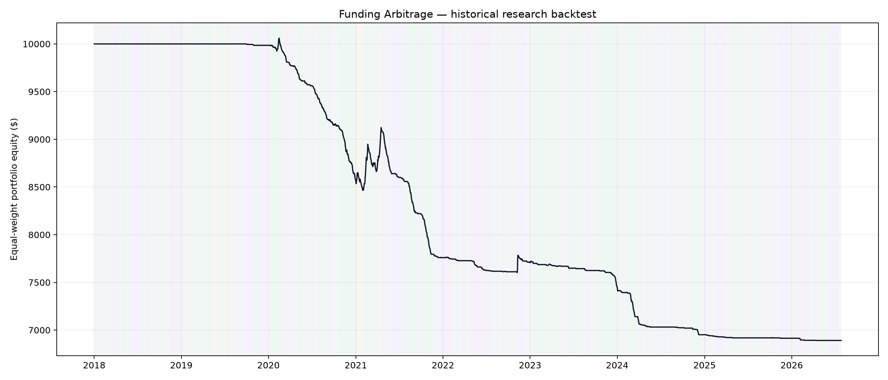

### Statistical Arbitrage

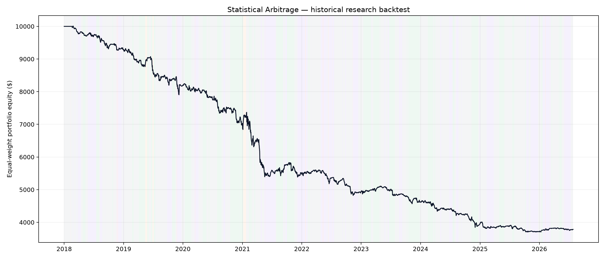

### Market Making

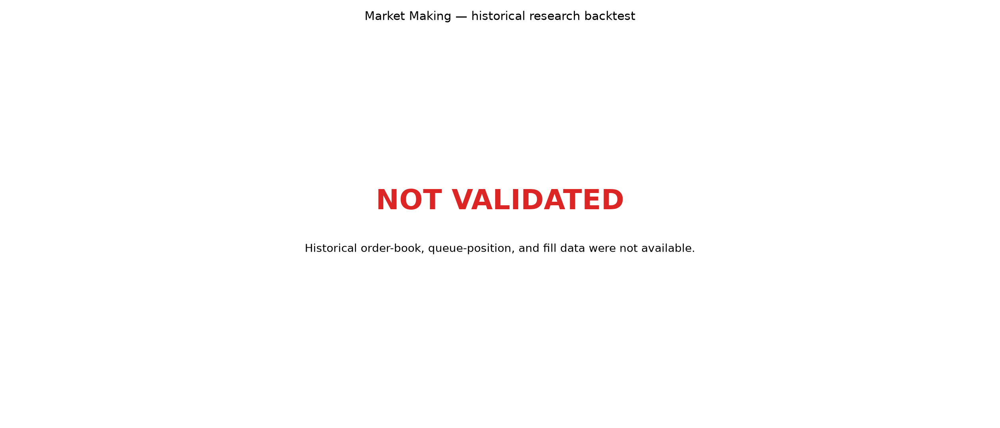

### Contrarian

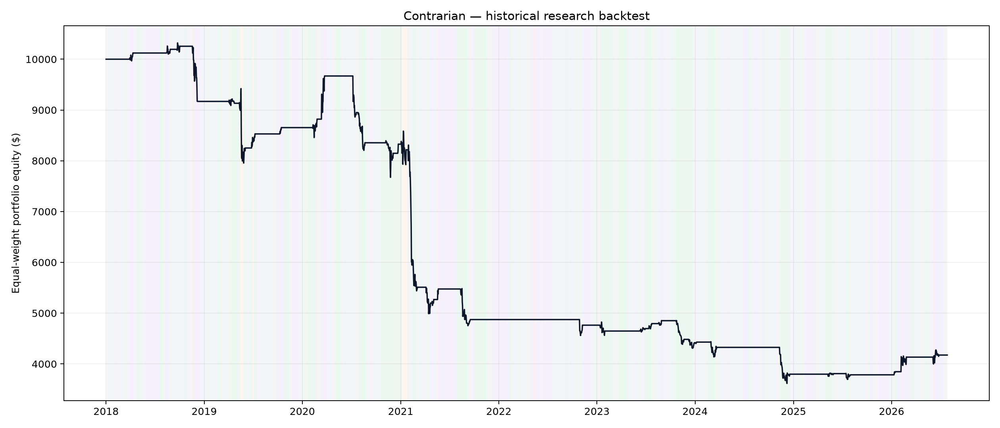

## Caveats and limitations

- Results are in-sample over one pinned historical window; no sealed holdout claim is made.
- Regime labels use completed daily bars and become available the following day. Range/Chop is the residual fifth class; `range_rule_matched` discloses when the strict ADX/Bollinger rule itself matched.
- Signals execute no earlier than the next bar open. Bar data cannot resolve intrabar ordering or liquidity depth.
- Fixed 0.15% one-way costs are intentionally simple and can understate stressed-market costs, borrow, spread, and market impact.
- Momentum and statistical arbitrage are portfolio/pair strategies; per-asset rows are leg contributions, not standalone deployable strategies.
- DCA spends $100 weekly from the fixed $10,000 starting cash until depleted; it does not assume unbounded external contributions.
- Funding arbitrage excludes basis convergence/divergence, borrow availability and cost, collateral yield, liquidation, and transfer risk.
- Survivorship bias remains because the requested universe is today's named set rather than a point-in-time investable universe.
- POL combines non-overlapping MATICUSDT and POLUSDT exchange histories and retains the migration gap without interpolation.

## Reproduce

```bash
uv sync --extra dev
uv run crypto-regime-backtest verify
uv run crypto-regime-backtest run
uv run crypto-regime-backtest report
```

Use `uv run crypto-regime-backtest fetch --refresh` only when intentionally creating a new data snapshot; refreshed outputs will not match the committed checksums or report.
