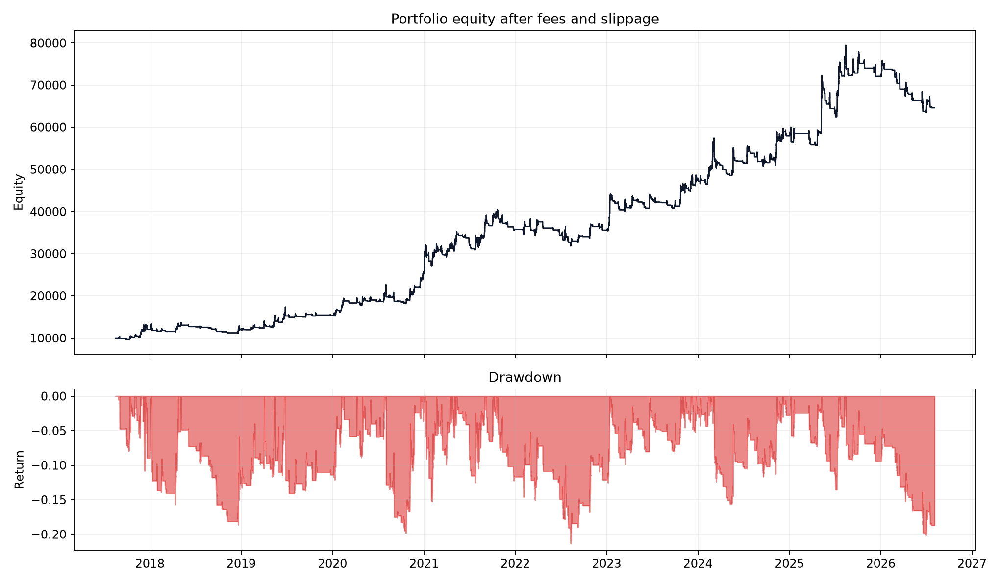
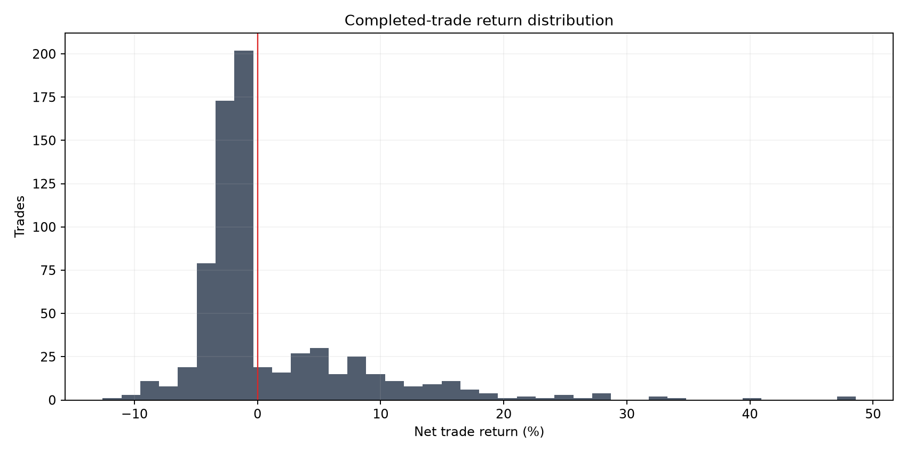

# Breakout Acceptance and Rejection

**Experiment:** `EXP-2026-08-04-BO-001`

**Verdict:** **RESEARCH CANDIDATE**

**Primary metric:** Sealed 2024–2026 net total return after costs

## Hypothesis

A breakout that remains above prior resistance contains more persistent demand than an immediate breakout, while a rapid close back inside the range identifies trapped late buyers and a tradeable short.

## Economic reasoning

Accepted breakouts may be paid by under-positioned trend followers and short optionality/inventory providers forced to chase. Rejection shorts may be paid by leveraged breakout buyers exiting after the old resistance level fails.

## Exact rules

- Selected only from development and validation: Immediate Long, lookback 50, window 2, buffer 0.1 ATR.
- The previous rolling high is shifted one candle and never includes the current candle.
- Immediate long enters after a close above the level; acceptance long requires a later close above it; rejection short requires a close back below within the declared window.
- Every entry fills at the next open. The delayed robustness case waits one additional candle.
- Exit at a reference-level failure/reclaim, a 2-ATR stop, or after 24 held candles.
- The 2024–2026 forward window is evaluated only after the candidate is selected by pre-2024 data.

## Data period and quality

Finalized Binance spot 4h OHLCV, requested from 2016-01-01T00:00:00+00:00 through 2026-08-04T12:00:00+00:00 (exclusive). Actual coverage starts at each symbol's exchange listing and gaps are not filled.

| symbol | rows | first_timestamp | last_timestamp | end_exclusive | missing_candles | duplicates_removed |
| --- | --- | --- | --- | --- | --- | --- |
| BTCUSDT | 19630 | 2017-08-17T04:00:00+00:00 | 2026-08-04T08:00:00+00:00 | 2026-08-04T12:00:00+00:00 | 16 | 0 |
| ETHUSDT | 19630 | 2017-08-17T04:00:00+00:00 | 2026-08-04T08:00:00+00:00 | 2026-08-04T12:00:00+00:00 | 16 | 0 |
| SOLUSDT | 13106 | 2020-08-11T04:00:00+00:00 | 2026-08-04T08:00:00+00:00 | 2026-08-04T12:00:00+00:00 | 0 | 0 |

## Cost and sizing assumptions

Initial portfolio $10,000; fee 5.0 bp and slippage 5.0 bp per side. Sizing=fixed_fraction; default entry delay=1 bar.

## Main results

| variant | total_return | cagr | sharpe | sortino | maximum_drawdown | win_rate | profit_factor | trades | exposure |
| --- | --- | --- | --- | --- | --- | --- | --- | --- | --- |
| Selected: Immediate Long | 5.4621 | 0.2314 | 0.9965 | 0.6688 | 0.2133 | 0.2958 | 1.5102 | 710 | 0.1522 |
| Doubled costs | 2.9744 | 0.1664 | 0.7682 | 0.5183 | 0.2521 | 0.2897 | 1.3703 | 711 | 0.1520 |
| Entry delayed one extra bar | 3.2904 | 0.1764 | 0.8323 | 0.5504 | 0.2227 | 0.3343 | 1.4572 | 697 | 0.1456 |
| Volatility-adjusted sizing | 0.8958 | 0.0740 | 1.2705 | 0.9389 | 0.0550 | 0.2958 | 1.5102 | 710 | 0.1522 |





## Results by asset

| total_return | cagr | sharpe | sortino | maximum_drawdown | win_rate | profit_factor | trades | exposure | asset |
| --- | --- | --- | --- | --- | --- | --- | --- | --- | --- |
| 3.4087 | 0.1800 | 0.7441 | 0.4198 | 0.3848 | 0.2943 | 1.4769 | 265 | 0.1774 | BTCUSDT |
| 11.3426 | 0.3236 | 0.9698 | 0.5293 | 0.3270 | 0.3254 | 1.6970 | 252 | 0.1694 | ETHUSDT |
| 1.6352 | 0.1759 | 0.5717 | 0.3526 | 0.4840 | 0.2591 | 1.3572 | 193 | 0.1645 | SOLUSDT |

## Results by time period

| variant | total_return | cagr | sharpe | sortino | maximum_drawdown | win_rate | profit_factor | trades | exposure |
| --- | --- | --- | --- | --- | --- | --- | --- | --- | --- |
| Development 2016–2020 | 0.8092 | 0.2839 | 0.9074 | 0.5299 | 0.2461 | 0.3140 | 1.5984 | 121 | 0.1618 |
| Validation 2020–2024 | 1.9374 | 0.3092 | 1.1654 | 0.8422 | 0.2285 | 0.3041 | 1.5843 | 365 | 0.1717 |
| Forward 2024–2026 | 0.2815 | 0.1004 | 0.6057 | 0.4488 | 0.2020 | 0.2723 | 1.2747 | 224 | 0.1627 |
| 2017 | 0.2044 | 0.6428 | 1.6971 | 1.1828 | 0.1082 | 0.3333 | 2.0537 | 27 | 0.1506 |
| 2018 | -0.0048 | -0.0048 | 0.0845 | 0.0441 | 0.1863 | 0.2558 | 1.0667 | 43 | 0.0866 |
| 2019 | 0.2844 | 0.2848 | 1.1108 | 0.6467 | 0.1407 | 0.3529 | 1.8389 | 51 | 0.1130 |
| 2020 | 0.6517 | 0.6503 | 1.8887 | 1.2123 | 0.1981 | 0.3875 | 2.2170 | 80 | 0.1663 |
| 2021 | 0.4053 | 0.4057 | 1.2106 | 1.0388 | 0.1525 | 0.2558 | 1.5496 | 129 | 0.2209 |
| 2022 | -0.0049 | -0.0049 | 0.0651 | 0.0386 | 0.1700 | 0.2143 | 0.8501 | 70 | 0.1169 |
| 2023 | 0.3329 | 0.3332 | 1.4773 | 1.2358 | 0.0990 | 0.3721 | 1.8921 | 86 | 0.1828 |
| 2024 | 0.2233 | 0.2228 | 1.0902 | 0.8154 | 0.1560 | 0.2857 | 1.3372 | 105 | 0.1963 |
| 2025 | 0.2426 | 0.2428 | 1.2220 | 0.9254 | 0.1354 | 0.2973 | 1.7490 | 74 | 0.1505 |
| 2026 | -0.1030 | -0.1683 | -1.3048 | -0.8342 | 0.1617 | 0.2000 | 0.4747 | 45 | 0.1263 |

## Baseline comparison

| variant | total_return | cagr | sharpe | sortino | maximum_drawdown | win_rate | profit_factor | trades | exposure | return_5th_percentile | return_95th_percentile |
| --- | --- | --- | --- | --- | --- | --- | --- | --- | --- | --- | --- |
| Immediate Long | 5.4621 | 0.2314 | 0.9965 | 0.6688 | 0.2133 | 0.2958 | 1.5102 | 710 | 0.1522 | — | — |
| Acceptance Long | 3.4910 | 0.1824 | 0.8819 | 0.5746 | 0.2200 | 0.3451 | 1.4779 | 568 | 0.1396 | — | — |
| Rejection Short | -0.9365 | -0.2648 | -0.9564 | -0.7598 | 0.9568 | 0.2379 | 0.7199 | 1244 | 0.2413 | — | — |
| Simple 50-bar trend | 11.9024 | 0.3302 | 0.8521 | 0.9067 | 0.5791 | 0.1970 | 1.5156 | 1772 | 0.4794 | — | — |
| Buy and hold | 14.2417 | 0.3551 | 0.7808 | 1.0121 | 0.9079 | 1.0000 | — | 3 | 0.8892 | — | — |
| Random baseline mean (20 seeds) | 1.6604 | — | 0.3896 | — | 0.6093 | — | — | 710 | — | -0.4291 | 5.0645 |

## Parameter and family comparison

| section | lookback | window | atr_buffer | development_return | validation_return | development_sharpe | validation_sharpe | selection_score | family |
| --- | --- | --- | --- | --- | --- | --- | --- | --- | --- |
| Acceptance parameter matrix | 20 | 1 | 0.0000 | 0.3745 | 1.9153 | 0.5543 | 1.0168 | 0.7856 | — |
| Acceptance parameter matrix | 20 | 1 | 0.1000 | 0.5213 | 1.6311 | 0.6736 | 0.9419 | 0.8077 | — |
| Acceptance parameter matrix | 20 | 2 | 0.0000 | 0.4462 | 2.7394 | 0.6086 | 1.1585 | 0.8836 | — |
| Acceptance parameter matrix | 20 | 2 | 0.1000 | 0.5271 | 2.6504 | 0.6742 | 1.1585 | 0.9164 | — |
| Acceptance parameter matrix | 50 | 1 | 0.0000 | 0.3609 | 1.5166 | 0.5647 | 1.1007 | 0.8327 | — |
| Acceptance parameter matrix | 50 | 1 | 0.1000 | 0.4100 | 1.6888 | 0.6103 | 1.1653 | 0.8878 | — |
| Acceptance parameter matrix | 50 | 2 | 0.0000 | 0.4871 | 1.6678 | 0.6791 | 1.1393 | 0.9092 | — |
| Acceptance parameter matrix | 50 | 2 | 0.1000 | 0.5289 | 1.7135 | 0.7149 | 1.1483 | 0.9316 | — |
| Family comparison | 50 | 2 | 0.1000 | 0.8092 | 1.9374 | 0.9074 | 1.1654 | 1.0364 | Immediate Long |
| Family comparison | 50 | 2 | 0.1000 | 0.5289 | 1.7135 | 0.7149 | 1.1483 | 0.9316 | Acceptance Long |
| Family comparison | 50 | 2 | 0.1000 | -0.6607 | -0.8054 | -1.2877 | -1.3059 | -11.4662 | Rejection Short |

## Robustness and attempted falsification

| test | result | status |
| --- | --- | --- |
| Base costs | return=5.462141891340221; Sharpe=0.9964647808727173; maxDD=0.21333249580902647 | Pass |
| Doubled costs | return=2.974426565177273; Sharpe=0.768249128017812; maxDD=0.25210241703895053 | Pass |
| One-extra-bar delay | return=3.2904106141100398; Sharpe=0.8323322007119852; maxDD=0.22270871535162817 | Pass |
| Forward 2024–2026 | return=0.28148678570693253; Sharpe=0.6057437789937524; maxDD=0.20204613274557848 | Pass |
| Remove best asset (ETHUSDT) | return=2.521923491301222; Sharpe=0.733388466758779; maxDD=0.2594704656343998 | Pass |
| Remove best year (2020) | return=2.9125274437730035; Sharpe=0.8595907430958696; maxDD=0.21333249580902613 | Pass |
| Volatility-adjusted sizing | return=0.8957630474295541; Sharpe=1.2704691616571724; maxDD=0.05498134383847508 | Pass |
| Winner concentration | largest=0.024779868240995904; top5=0.10382015853573999 | Pass |
| Immediate breakout comparison | selected 5.4621 vs immediate 5.4621 | Selected baseline |
| Nearby lookback 15 | return=1.7204295540875467; Sharpe=0.5262781517272451 | Pass |
| Nearby lookback 20 | return=2.524351502867056; Sharpe=0.6334302370621678 | Pass |
| Nearby lookback 30 | return=3.285951430403845; Sharpe=0.7511350161541428 | Pass |
| Nearby lookback 50 | return=5.462141891340221; Sharpe=0.9964647808727173 | Pass |
| Nearby lookback 75 | return=5.971132919383636; Sharpe=1.0927537652258263 | Pass |
| Exit horizon 12 | return=2.1317417178177176; Sharpe=0.7616222436736624 | Pass |
| Exit horizon 24 | return=5.462141891340221; Sharpe=0.9964647808727173 | Pass |
| Exit horizon 48 | return=10.95913241250407; Sharpe=1.0982027844420033 | Pass |
| Entry regime: bull | trades=604; compounded trade return=165.4699 | Descriptive |
| Entry regime: sideways | trades=106; compounded trade return=-0.1386 | Descriptive |

## Pine/TradingView handoff (supplementary)

**SUPPLEMENTARY_FORWARD_TESTED_HISTORICAL_WINDOWS_DEFERRED**. Pine v6 source compiled successfully on TradingView. Defaults were reconciled to the Python-selected candidate: Immediate Long, 50-bar prior high, two-bar confirmation setting, 0.1 ATR buffer, 2 ATR stop, and 24-bar maximum hold.

| TradingView symbol | Window | Return | Max drawdown | Trades | Profit factor |
| --- | --- | ---: | ---: | ---: | ---: |
| `BINANCE:BTCUSDT` | Forward 2024-2026 | 1.49% | 15.07% | 79 | 1.016 |
| `BINANCE:ETHUSDT` | Forward 2024-2026 | 91.07% | 16.92% | 70 | 1.578 |
| `BINANCE:SOLUSDT` | Forward 2024-2026 | 21.27% | 28.04% | 87 | 1.159 |

TradingView supports the cross-market character of the selected breakout: positive forward return on BTC, ETH, and SOL, with ETH contributing the strongest result. These are independent per-symbol runs using 5 bp commission per side and zero slippage ticks. The Python portfolio combines all three symbols and also charges 5 bp proportional slippage per side, so exact percentage parity is not expected.

Deferred platform note: TradingView displayed its Deep Backtesting upgrade notice: the current Basic plan can calculate only with data loaded on the chart. Entire History and Custom Date Range triggered the upgrade gate, while Range from Chart and Bar Replay produced no usable pre-2024 4h tester data. Those historical platform runs are deferred and do not affect the Python verdict.

Python remains the validation authority; this platform record is supplementary.

No script or idea was published.

Pine strategy: [`pine/breakout_acceptance_rejection_strategy.pine`](../pine/breakout_acceptance_rejection_strategy.pine)

## Largest wins and losses reviewed

| symbol | direction | signal_timestamp | entry_timestamp | entry_price | exit_timestamp | exit_price | net_return | exit_reason |
| --- | --- | --- | --- | --- | --- | --- | --- | --- |
| ETHUSDT | long | 2021-01-02 12:00:00+00:00 | 2021-01-02 16:00:00+00:00 | 768.4500 | 2021-01-06 16:00:00+00:00 | 1144.0100 | 0.4860 | time_exit |
| SOLUSDT | long | 2021-08-15 08:00:00+00:00 | 2021-08-15 12:00:00+00:00 | 46.7680 | 2021-08-19 12:00:00+00:00 | 69.6000 | 0.4855 | time_exit |
| SOLUSDT | long | 2023-12-20 12:00:00+00:00 | 2023-12-20 16:00:00+00:00 | 80.6800 | 2023-12-24 16:00:00+00:00 | 113.5600 | 0.4049 | time_exit |
| SOLUSDT | long | 2021-08-27 16:00:00+00:00 | 2021-08-27 20:00:00+00:00 | 85.6400 | 2021-08-31 20:00:00+00:00 | 114.6900 | 0.3367 | time_exit |
| ETHUSDT | long | 2025-05-08 00:00:00+00:00 | 2025-05-08 04:00:00+00:00 | 1901.0900 | 2025-05-12 04:00:00+00:00 | 2520.0100 | 0.3231 | time_exit |
| SOLUSDT | long | 2021-09-09 00:00:00+00:00 | 2021-09-09 04:00:00+00:00 | 211.2000 | 2021-09-09 20:00:00+00:00 | 185.0100 | -0.1258 | reference_failure |
| SOLUSDT | long | 2021-02-19 12:00:00+00:00 | 2021-02-19 16:00:00+00:00 | 10.9511 | 2021-02-20 12:00:00+00:00 | 9.8249 | -0.1047 | atr_stop |
| SOLUSDT | long | 2021-01-04 16:00:00+00:00 | 2021-01-04 20:00:00+00:00 | 2.4397 | 2021-01-05 04:00:00+00:00 | 2.1927 | -0.1031 | reference_failure |
| ETHUSDT | long | 2021-01-07 12:00:00+00:00 | 2021-01-07 16:00:00+00:00 | 1249.8400 | 2021-01-07 16:00:00+00:00 | 1131.2491 | -0.0967 | atr_stop |
| SOLUSDT | long | 2021-09-07 04:00:00+00:00 | 2021-09-07 08:00:00+00:00 | 187.7900 | 2021-09-07 12:00:00+00:00 | 170.6940 | -0.0929 | atr_stop |

Manual ledger review: finite prices and sizes=yes; exit timestamps do not precede entries=yes. The listed extremes remain subject to candle-level path ambiguity and are not removed as outliers.

## Known limitations

- Development coverage is partial before Binance spot listings, and SOL has no 2016–2020 observations.
- Selection among a small declared family still creates multiple-testing risk; the forward window is the only untouched check.
- Four-hour OHLCV cannot resolve whether a level and stop were touched in an ambiguous intrabar order.
- Short spot execution, borrow availability, borrow cost, funding, and liquidation are not modelled; rejection shorts are research abstractions.
- Fixed slippage does not represent stressed breakout liquidity or market impact.

## Verdict

**RESEARCH CANDIDATE** — The strategy survived the core Python historical checks and is ready for Pine/TradingView review, but is not approved for paper or live trading.

## Next justified experiment

Add a predeclared volatility-compression filter to the selected acceptance rule and require incremental validation improvement over the unfiltered parent.

## Reproduce

```bash
edge-research run --config configs/breakout_acceptance.yaml
```

This is historical research, not investment advice or authorization for paper/live trading.
