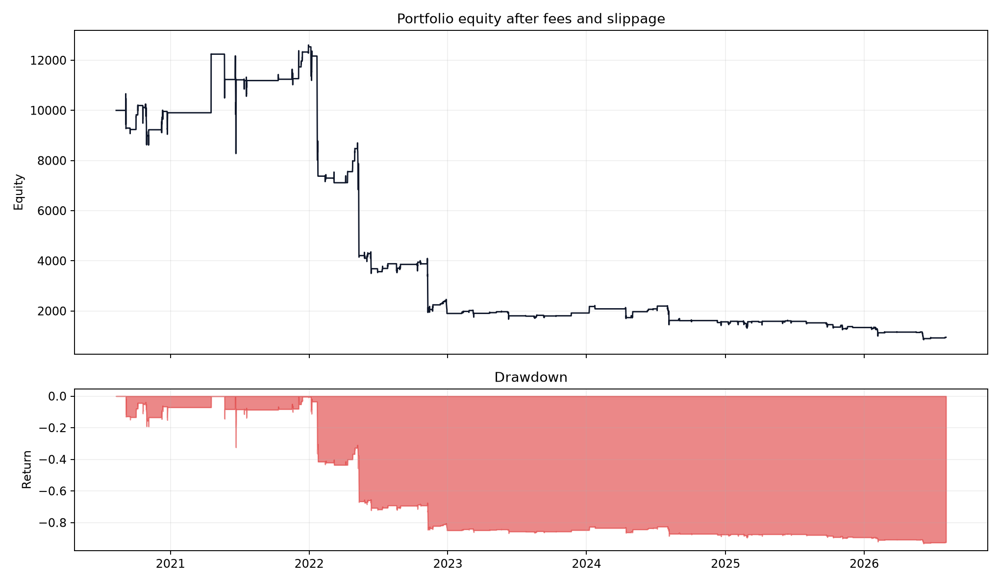
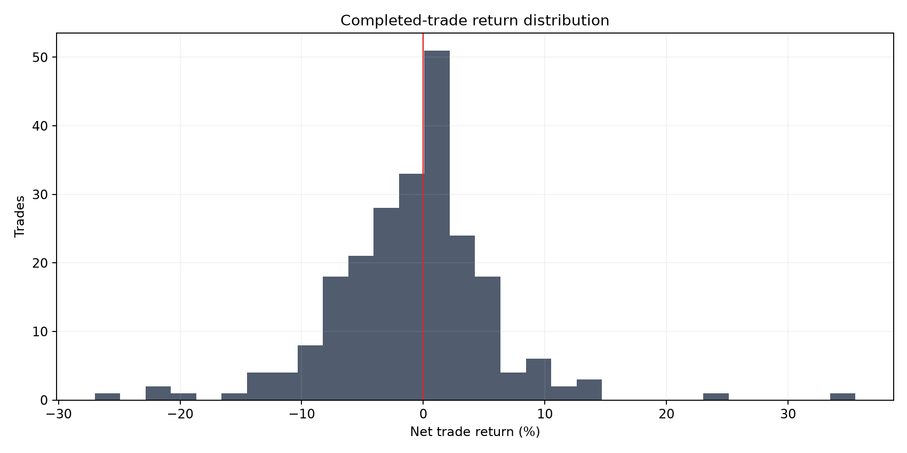

# RSI Oversold Mean Reversion

**Experiment:** `EXP-2026-08-04-RSI-001-MANUAL-SOLUSDT`

**Verdict:** **REJECTED**

**Primary metric:** Forward-window net total return after 5 bp fee and 5 bp slippage per side

## Hypothesis

Crypto assets rebound after RSI(14) closes below an oversold threshold.

## Economic reasoning

The proposed payer is a short-horizon forced seller or panic seller whose urgent flow temporarily pushes price below a local equilibrium. The hostile alternative is that RSI merely relabels large negative candles and adds no after-cost information.

## Exact rules

- Compute Wilder RSI(14) from completed four-hour closes.
- Frozen base entry: RSI below 30; small predeclared matrix uses 25, 30, and 35.
- Enter long at the next candle open; the delayed test enters one further bar later.
- Exit at the next open after RSI closes above 50, after four held candles, or at a two-ATR intrabar stop.
- No overlapping position in the same asset; the portfolio allocates one equal subaccount per selected symbol.

## Data period and quality

Finalized Binance spot 4h OHLCV, requested from 2016-01-01T00:00:00+00:00 through 2026-08-04T12:00:00+00:00 (exclusive). Actual coverage starts at each symbol's exchange listing and gaps are not filled.

| symbol | rows | first_timestamp | last_timestamp | end_exclusive | missing_candles | duplicates_removed |
| --- | --- | --- | --- | --- | --- | --- |
| SOLUSDT | 13106 | 2020-08-11T04:00:00+00:00 | 2026-08-04T08:00:00+00:00 | 2026-08-04T12:00:00+00:00 | 0 | 0 |

## Cost and sizing assumptions

Initial portfolio $10,000; fee 5.0 bp and slippage 5.0 bp per side. Sizing=fixed_fraction; default entry delay=1 bar.

## Main results

| variant | total_return | cagr | sharpe | sortino | maximum_drawdown | win_rate | profit_factor | trades | exposure |
| --- | --- | --- | --- | --- | --- | --- | --- | --- | --- |
| Frozen base | -0.9050 | -0.3254 | -0.8028 | -0.2583 | 0.9324 | 0.4892 | 0.7054 | 231 | 0.0761 |
| Doubled costs | -0.9383 | -0.3724 | -0.9834 | -0.3185 | 0.9531 | 0.4589 | 0.6478 | 231 | 0.0761 |
| Entry delayed one extra bar | -0.8892 | -0.3078 | -0.7827 | -0.2629 | 0.9119 | 0.4719 | 0.6930 | 231 | 0.0757 |





## Results by asset

| total_return | cagr | sharpe | sortino | maximum_drawdown | win_rate | profit_factor | trades | exposure | asset |
| --- | --- | --- | --- | --- | --- | --- | --- | --- | --- |
| -0.9050 | -0.3254 | -0.8028 | -0.2583 | 0.9324 | 0.4892 | 0.7054 | 231 | 0.0761 | SOLUSDT |

## Results by time period

| variant | total_return | cagr | sharpe | sortino | maximum_drawdown | win_rate | profit_factor | trades | exposure |
| --- | --- | --- | --- | --- | --- | --- | --- | --- | --- |
| Development 2016–2020 | 0.0000 | 0.0000 | — | — | 0.0000 | — | — | 0 | 0.0000 |
| Validation 2020–2024 | -0.8083 | -0.3858 | -0.8638 | -0.2691 | 0.8675 | 0.5159 | 0.6674 | 126 | 0.0737 |
| Forward 2024–2026 | -0.5045 | -0.2374 | -0.7233 | -0.2518 | 0.6150 | 0.4571 | 0.7657 | 105 | 0.0794 |
| 2020 | -0.0095 | -0.0241 | 0.1941 | 0.0733 | 0.1921 | 0.5294 | 1.0472 | 17 | 0.0910 |
| 2021 | 0.2654 | 0.2656 | 0.7567 | 0.2033 | 0.3244 | 0.6250 | 1.8026 | 16 | 0.0333 |
| 2022 | -0.8485 | -0.8487 | -2.8059 | -1.0446 | 0.8485 | 0.4462 | 0.3635 | 65 | 0.1233 |
| 2023 | 0.0095 | 0.0095 | 0.1453 | 0.0419 | 0.1774 | 0.6071 | 1.0786 | 28 | 0.0575 |
| 2024 | -0.1836 | -0.1832 | -0.4093 | -0.1135 | 0.3586 | 0.5000 | 0.8172 | 28 | 0.0551 |
| 2025 | -0.1446 | -0.1447 | -0.3980 | -0.1587 | 0.2311 | 0.4565 | 0.8815 | 46 | 0.0918 |
| 2026 | -0.2905 | -0.4411 | -2.0087 | -0.7823 | 0.3690 | 0.4194 | 0.5579 | 31 | 0.0998 |

## Baseline comparison

| variant | total_return | cagr | sharpe | sortino | maximum_drawdown | win_rate | profit_factor | trades | exposure | return_5th_percentile | return_95th_percentile |
| --- | --- | --- | --- | --- | --- | --- | --- | --- | --- | --- | --- |
| RSI frozen base | -0.9050 | -0.3254 | -0.8028 | -0.2583 | 0.9324 | 0.4892 | 0.7054 | 231 | 0.0761 | — | — |
| Large negative candle | -0.4499 | -0.0951 | 0.0825 | 0.0460 | 0.9074 | 0.4721 | 1.0284 | 538 | 0.1863 | — | — |
| Simple 50-bar trend | 19.2573 | 0.6538 | 1.0129 | 1.1123 | 0.7784 | 0.1991 | 1.7269 | 447 | 0.5177 | — | — |
| Buy and hold | 23.9233 | 0.7121 | 1.0410 | 1.4983 | 0.9660 | 1.0000 | — | 1 | 0.9999 | — | — |
| Random baseline mean (20 seeds) | -0.2070 | — | -0.0408 | — | 0.6156 | — | — | 231 | — | -0.6617 | 0.4442 |

## Parameter and family comparison

| variant | total_return | cagr | sharpe | sortino | maximum_drawdown | win_rate | profit_factor | trades | exposure | threshold | holding_bars |
| --- | --- | --- | --- | --- | --- | --- | --- | --- | --- | --- | --- |
| RSI<25, hold=2 | -0.2100 | -0.0386 | -0.0210 | -0.0042 | 0.5989 | 0.5315 | 0.9838 | 111 | 0.0240 | 25 | 2 |
| RSI<25, hold=4 | -0.5848 | -0.1367 | -0.3789 | -0.0768 | 0.7871 | 0.4479 | 0.8278 | 96 | 0.0314 | 25 | 4 |
| RSI<25, hold=8 | -0.5932 | -0.1396 | -0.2651 | -0.0733 | 0.7923 | 0.4494 | 0.8723 | 89 | 0.0449 | 25 | 8 |
| RSI<30, hold=2 | -0.4389 | -0.0921 | -0.0976 | -0.0311 | 0.7405 | 0.5439 | 0.9557 | 285 | 0.0616 | 30 | 2 |
| RSI<30, hold=4 | -0.9050 | -0.3254 | -0.8028 | -0.2583 | 0.9324 | 0.4892 | 0.7054 | 231 | 0.0761 | 30 | 4 |
| RSI<30, hold=8 | -0.7589 | -0.2117 | -0.2829 | -0.1179 | 0.8941 | 0.4752 | 0.8786 | 202 | 0.1043 | 30 | 8 |
| RSI<35, hold=2 | -0.9155 | -0.3385 | -0.6793 | -0.3137 | 0.9660 | 0.4942 | 0.8137 | 607 | 0.1312 | 35 | 2 |
| RSI<35, hold=4 | -0.9758 | -0.4634 | -1.0221 | -0.4778 | 0.9825 | 0.4742 | 0.7344 | 466 | 0.1553 | 35 | 4 |
| RSI<35, hold=8 | -0.9768 | -0.4670 | -0.8541 | -0.4660 | 0.9891 | 0.4424 | 0.7572 | 373 | 0.1892 | 35 | 8 |

## Robustness and attempted falsification

| test | result | status |
| --- | --- | --- |
| Base costs | return=-0.9050100586535443; Sharpe=-0.8027678724076993; maxDD=0.9323575846184711 | Fail |
| Doubled costs | return=-0.9383453859422147; Sharpe=-0.9834167759751842; maxDD=0.9530586124116963 | Fail |
| One-extra-bar delay | return=-0.8892300346720983; Sharpe=-0.782727573638116; maxDD=0.9118591357741106 | Fail |
| Forward 2024–2026 | return=-0.5045413897558187; Sharpe=-0.7232831554489186; maxDD=0.61499409558555 | Fail |
| Random baseline (20 fixed seeds) | mean return -0.2070; 5–95% in machine results | Comparison |

## Pine/TradingView handoff (supplementary)

DEFERRED — no supplementary TradingView record was requested for this manual run. Python remains the validation authority.

Pine strategy: [`pine/rsi_mean_reversion_strategy.pine`](../pine/rsi_mean_reversion_strategy.pine)

## Largest wins and losses reviewed

| symbol | direction | signal_timestamp | entry_timestamp | entry_price | exit_timestamp | exit_price | net_return | exit_reason |
| --- | --- | --- | --- | --- | --- | --- | --- | --- |
| SOLUSDT | long | 2021-06-22 08:00:00+00:00 | 2021-06-22 12:00:00+00:00 | 22.0580 | 2021-06-23 04:00:00+00:00 | 29.9520 | 0.3553 | time_exit |
| SOLUSDT | long | 2021-04-18 00:00:00+00:00 | 2021-04-18 04:00:00+00:00 | 22.0000 | 2021-04-18 08:00:00+00:00 | 27.2438 | 0.2360 | signal_exit |
| SOLUSDT | long | 2025-02-28 00:00:00+00:00 | 2025-02-28 04:00:00+00:00 | 127.6200 | 2025-02-28 16:00:00+00:00 | 145.6700 | 0.1392 | signal_exit |
| SOLUSDT | long | 2024-01-08 00:00:00+00:00 | 2024-01-08 04:00:00+00:00 | 87.2400 | 2024-01-08 20:00:00+00:00 | 99.2600 | 0.1356 | time_exit |
| SOLUSDT | long | 2026-02-06 00:00:00+00:00 | 2026-02-06 04:00:00+00:00 | 76.7100 | 2026-02-06 20:00:00+00:00 | 87.0900 | 0.1331 | time_exit |
| SOLUSDT | long | 2022-11-09 08:00:00+00:00 | 2022-11-09 12:00:00+00:00 | 20.0500 | 2022-11-09 16:00:00+00:00 | 14.6657 | -0.2701 | atr_stop |
| SOLUSDT | long | 2022-05-11 20:00:00+00:00 | 2022-05-12 00:00:00+00:00 | 50.9000 | 2022-05-12 04:00:00+00:00 | 39.4105 | -0.2274 | atr_stop |
| SOLUSDT | long | 2022-11-08 16:00:00+00:00 | 2022-11-08 20:00:00+00:00 | 23.7700 | 2022-11-09 08:00:00+00:00 | 18.7334 | -0.2136 | atr_stop |
| SOLUSDT | long | 2022-05-11 12:00:00+00:00 | 2022-05-11 16:00:00+00:00 | 55.5200 | 2022-05-11 20:00:00+00:00 | 44.9921 | -0.1913 | atr_stop |
| SOLUSDT | long | 2021-06-21 20:00:00+00:00 | 2021-06-22 00:00:00+00:00 | 26.5970 | 2021-06-22 08:00:00+00:00 | 22.4333 | -0.1583 | atr_stop |

Manual ledger review: finite prices and sizes=yes; exit timestamps do not precede entries=yes. The listed extremes remain subject to candle-level path ambiguity and are not removed as outliers.

## Known limitations

- The 2016–2020 development window begins at each Binance symbol's actual listing date; SOL has no observations in that window.
- Four-hour candles cannot establish intrabar path ordering beyond the conservative stop convention.
- Fixed 5 bp slippage does not model stressed spread, depth, or market impact.
- The three-asset default universe is selected with hindsight and is too narrow for a general crypto claim.
- Random entries match per-symbol trade counts and time exits, but not every realized stop duration.

## Verdict

**REJECTED** — Net profitability failed in: full sample, forward window, doubled costs, one-extra-bar delay.

## Next justified experiment

Test whether volatility compression improves breakout acceptance; do not tune another RSI threshold from the forward window.

## Reproduce

```bash
edge-research run --config configs/rsi_mean_reversion.yaml --symbols SOLUSDT
```

This is historical research, not investment advice or authorization for paper/live trading.
