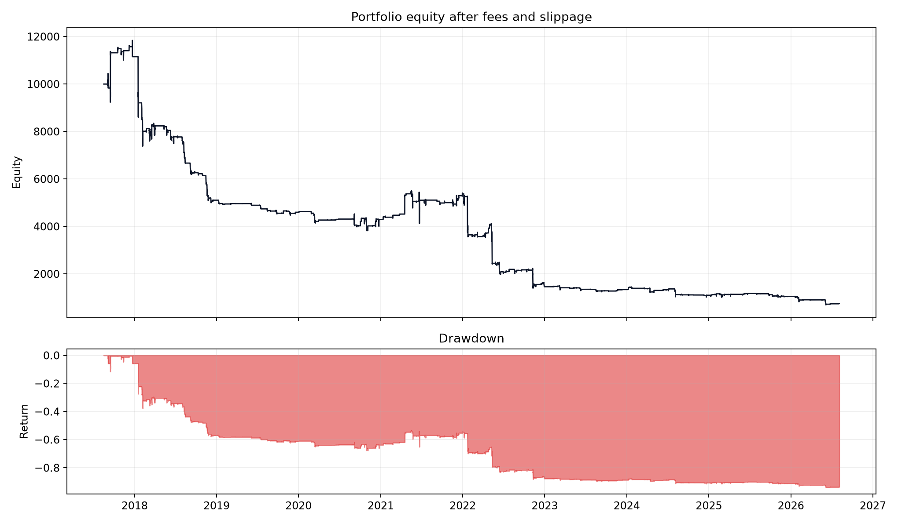
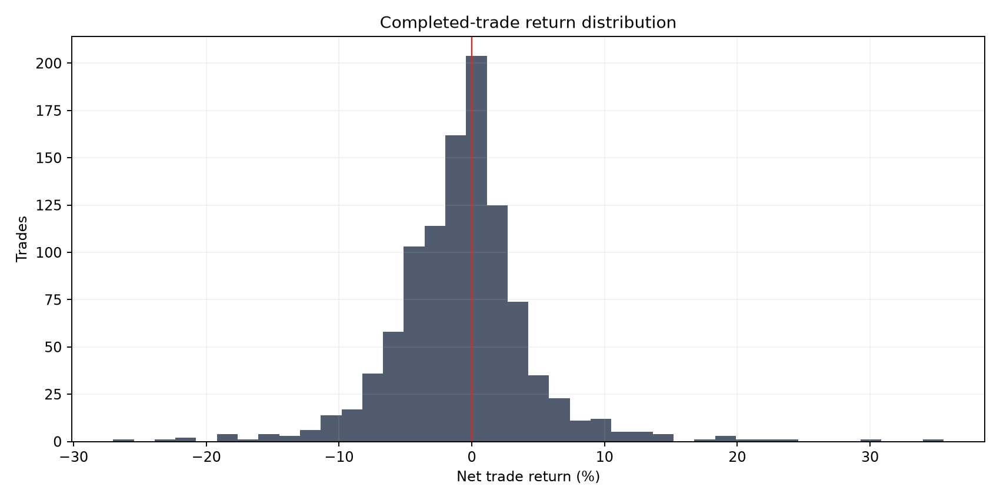

# RSI Oversold Mean Reversion

**Experiment:** `EXP-2026-08-04-RSI-001`

**Verdict:** **REJECTED**

**Primary metric:** Forward-window net total return after 5 bp fee and 5 bp slippage per side

## Hypothesis

Crypto assets rebound after RSI(14) closes below an oversold threshold.

## Economic reasoning

The proposed payer is a short-horizon forced seller or panic seller whose urgent flow temporarily pushes price below a local equilibrium. The hostile alternative is that RSI merely relabels large negative candles and adds no after-cost information.

## Exact rules

- Compute Wilder RSI(14) from completed four-hour closes.
- Frozen base entry: RSI below 30; small predeclared matrix uses 25, 30, and 35.
- Enter long at the next candle open; the delayed test enters one further bar later.
- Exit at the next open after RSI closes above 50, after four held candles, or at a two-ATR intrabar stop.
- No overlapping position in the same asset; the portfolio allocates one equal subaccount per selected symbol.

## Data period and quality

Finalized Binance spot 4h OHLCV, requested from 2016-01-01T00:00:00+00:00 through 2026-08-04T12:00:00+00:00 (exclusive). Actual coverage starts at each symbol's exchange listing and gaps are not filled.

| symbol | rows | first_timestamp | last_timestamp | end_exclusive | missing_candles | duplicates_removed |
| --- | --- | --- | --- | --- | --- | --- |
| BTCUSDT | 19630 | 2017-08-17T04:00:00+00:00 | 2026-08-04T08:00:00+00:00 | 2026-08-04T12:00:00+00:00 | 16 | 0 |
| ETHUSDT | 19630 | 2017-08-17T04:00:00+00:00 | 2026-08-04T08:00:00+00:00 | 2026-08-04T12:00:00+00:00 | 16 | 0 |
| SOLUSDT | 13106 | 2020-08-11T04:00:00+00:00 | 2026-08-04T08:00:00+00:00 | 2026-08-04T12:00:00+00:00 | 0 | 0 |

## Cost and sizing assumptions

Initial portfolio $10,000; fee 5.0 bp and slippage 5.0 bp per side. Sizing=fixed_fraction; default entry delay=1 bar.

## Main results

| variant | total_return | cagr | sharpe | sortino | maximum_drawdown | win_rate | profit_factor | trades | exposure |
| --- | --- | --- | --- | --- | --- | --- | --- | --- | --- |
| Frozen base | -0.9251 | -0.2511 | -0.9674 | -0.3985 | 0.9409 | 0.4405 | 0.6660 | 1033 | 0.0734 |
| Doubled costs | -0.9587 | -0.2993 | -1.1586 | -0.4741 | 0.9672 | 0.4137 | 0.5979 | 1037 | 0.0735 |
| Entry delayed one extra bar | -0.8488 | -0.1900 | -0.8202 | -0.3582 | 0.8575 | 0.4594 | 0.7561 | 1023 | 0.0729 |





## Results by asset

| total_return | cagr | sharpe | sortino | maximum_drawdown | win_rate | profit_factor | trades | exposure | asset |
| --- | --- | --- | --- | --- | --- | --- | --- | --- | --- |
| -0.8833 | -0.2131 | -0.6662 | -0.2433 | 0.9033 | 0.4388 | 0.7190 | 392 | 0.0837 | BTCUSDT |
| -0.9870 | -0.3841 | -1.1431 | -0.4256 | 0.9911 | 0.4146 | 0.6046 | 410 | 0.0858 | ETHUSDT |
| -0.9050 | -0.3254 | -0.8028 | -0.2583 | 0.9324 | 0.4892 | 0.7054 | 231 | 0.0761 | SOLUSDT |

## Results by time period

| variant | total_return | cagr | sharpe | sortino | maximum_drawdown | win_rate | profit_factor | trades | exposure |
| --- | --- | --- | --- | --- | --- | --- | --- | --- | --- |
| Development 2016–2020 | -0.8105 | -0.5039 | -1.5165 | -0.7666 | 0.8663 | 0.3727 | 0.5234 | 271 | 0.1060 |
| Validation 2020–2024 | -0.6017 | -0.2056 | -0.8396 | -0.3401 | 0.6543 | 0.4743 | 0.7461 | 428 | 0.0700 |
| Forward 2024–2026 | -0.4800 | -0.2231 | -1.1013 | -0.4630 | 0.5335 | 0.4521 | 0.7081 | 334 | 0.0813 |
| 2017 | 0.1153 | 0.3382 | 0.9282 | 0.5539 | 0.1160 | 0.5714 | 1.8922 | 14 | 0.0235 |
| 2018 | -0.5421 | -0.5425 | -2.7442 | -1.3328 | 0.5520 | 0.3250 | 0.4322 | 160 | 0.0974 |
| 2019 | -0.0998 | -0.0999 | -1.8535 | -0.7463 | 0.1246 | 0.4227 | 0.4518 | 97 | 0.0616 |
| 2020 | -0.0671 | -0.0670 | -0.1523 | -0.0520 | 0.1748 | 0.5522 | 0.8002 | 67 | 0.0433 |
| 2021 | 0.2530 | 0.2531 | 0.8469 | 0.3508 | 0.2514 | 0.5634 | 1.3984 | 71 | 0.0481 |
| 2022 | -0.7288 | -0.7291 | -2.8330 | -1.2955 | 0.7401 | 0.4219 | 0.5360 | 192 | 0.1263 |
| 2023 | -0.0799 | -0.0799 | -0.7145 | -0.2773 | 0.1668 | 0.4592 | 0.7313 | 98 | 0.0624 |
| 2024 | -0.1795 | -0.1791 | -0.7091 | -0.2599 | 0.2968 | 0.4757 | 0.7405 | 103 | 0.0659 |
| 2025 | -0.0436 | -0.0436 | -0.1202 | -0.0556 | 0.1369 | 0.4857 | 0.8957 | 140 | 0.0892 |
| 2026 | -0.2881 | -0.4378 | -2.7021 | -1.1274 | 0.3367 | 0.3736 | 0.4591 | 91 | 0.0941 |

## Baseline comparison

| variant | total_return | cagr | sharpe | sortino | maximum_drawdown | win_rate | profit_factor | trades | exposure | return_5th_percentile | return_95th_percentile |
| --- | --- | --- | --- | --- | --- | --- | --- | --- | --- | --- | --- |
| RSI frozen base | -0.9251 | -0.2511 | -0.9674 | -0.3985 | 0.9409 | 0.4405 | 0.6660 | 1033 | 0.0734 | — | — |
| Large negative candle | -0.7957 | -0.1624 | -0.1872 | -0.1237 | 0.9037 | 0.4603 | 0.8507 | 2290 | 0.1719 | — | — |
| Simple 50-bar trend | 11.9024 | 0.3302 | 0.8521 | 0.9067 | 0.5791 | 0.1970 | 1.5156 | 1772 | 0.4794 | — | — |
| Buy and hold | 14.2417 | 0.3551 | 0.7808 | 1.0121 | 0.9079 | 1.0000 | — | 3 | 0.8892 | — | — |
| Random baseline mean (20 seeds) | -0.2818 | — | -0.2092 | — | 0.5244 | — | — | 1033 | — | -0.6078 | 0.0994 |

## Parameter and family comparison

| variant | total_return | cagr | sharpe | sortino | maximum_drawdown | win_rate | profit_factor | trades | exposure | threshold | holding_bars |
| --- | --- | --- | --- | --- | --- | --- | --- | --- | --- | --- | --- |
| RSI<25, hold=2 | -0.4221 | -0.0593 | -0.3064 | -0.1005 | 0.6001 | 0.4833 | 0.8794 | 598 | 0.0278 | 25 | 2 |
| RSI<25, hold=4 | -0.6585 | -0.1130 | -0.5296 | -0.1697 | 0.7221 | 0.4614 | 0.7634 | 505 | 0.0356 | 25 | 4 |
| RSI<25, hold=8 | -0.5438 | -0.0838 | -0.2679 | -0.1105 | 0.6517 | 0.4526 | 0.8933 | 464 | 0.0505 | 25 | 8 |
| RSI<30, hold=2 | -0.7298 | -0.1358 | -0.4422 | -0.1830 | 0.7857 | 0.4837 | 0.7684 | 1319 | 0.0619 | 30 | 2 |
| RSI<30, hold=4 | -0.9251 | -0.2511 | -0.9674 | -0.3985 | 0.9409 | 0.4405 | 0.6660 | 1033 | 0.0734 | 30 | 4 |
| RSI<30, hold=8 | -0.8753 | -0.2073 | -0.5229 | -0.2542 | 0.8871 | 0.4362 | 0.7693 | 901 | 0.0984 | 30 | 8 |
| RSI<35, hold=2 | -0.9518 | -0.2870 | -0.8369 | -0.4602 | 0.9642 | 0.4686 | 0.7292 | 2512 | 0.1197 | 35 | 2 |
| RSI<35, hold=4 | -0.9736 | -0.3333 | -1.0307 | -0.5706 | 0.9828 | 0.4745 | 0.7367 | 1918 | 0.1403 | 35 | 4 |
| RSI<35, hold=8 | -0.9786 | -0.3488 | -0.8805 | -0.5382 | 0.9819 | 0.4485 | 0.7556 | 1534 | 0.1699 | 35 | 8 |

## Robustness and attempted falsification

| test | result | status |
| --- | --- | --- |
| Base costs | return=-0.9250994646123589; Sharpe=-0.9674363083395907; maxDD=0.9408862635896458 | Fail |
| Doubled costs | return=-0.9587337843112964; Sharpe=-1.1585636640329735; maxDD=0.9671701990417897 | Fail |
| One-extra-bar delay | return=-0.8488163323821364; Sharpe=-0.8201538393761819; maxDD=0.857505823549537 | Fail |
| Forward 2024–2026 | return=-0.4800487287335925; Sharpe=-1.1012794694205161; maxDD=0.5334537005511724 | Fail |
| Random baseline (20 fixed seeds) | mean return -0.2818; 5–95% in machine results | Comparison |

## Pine/TradingView handoff (supplementary)

**SUPPLEMENTARY_FORWARD_TESTED_HISTORICAL_WINDOWS_DEFERRED**. Pine v6 source compiled successfully on TradingView with no look-ahead warning.

| TradingView symbol | Window | Return | Max drawdown | Trades | Profit factor |
| --- | --- | ---: | ---: | ---: | ---: |
| `BINANCE:BTCUSDT` | Forward 2024-2026 | -16.10% | 27.00% | 101 | 0.860 |
| `BINANCE:ETHUSDT` | Forward 2024-2026 | -60.04% | 63.46% | 122 | 0.606 |
| `BINANCE:SOLUSDT` | Forward 2024-2026 | -40.51% | 58.75% | 124 | 0.818 |

TradingView confirms the RSI failure on every default market. These are independent per-symbol runs using 5 bp commission per side and zero slippage ticks. The Python portfolio run combines all three symbols and also charges 5 bp proportional slippage per side, so exact percentage parity is not expected.

Deferred platform note: TradingView displayed its Deep Backtesting upgrade notice: the current Basic plan can calculate only with data loaded on the chart. Entire History and Custom Date Range triggered the upgrade gate, while Range from Chart and Bar Replay produced no usable pre-2024 4h tester data. Those historical platform runs are deferred and do not affect the Python verdict.

Python remains the validation authority; this platform record is supplementary.

No script or idea was published.

Pine strategy: [`pine/rsi_mean_reversion_strategy.pine`](../pine/rsi_mean_reversion_strategy.pine)

## Largest wins and losses reviewed

| symbol | direction | signal_timestamp | entry_timestamp | entry_price | exit_timestamp | exit_price | net_return | exit_reason |
| --- | --- | --- | --- | --- | --- | --- | --- | --- |
| SOLUSDT | long | 2021-06-22 08:00:00+00:00 | 2021-06-22 12:00:00+00:00 | 22.0580 | 2021-06-23 04:00:00+00:00 | 29.9520 | 0.3553 | time_exit |
| ETHUSDT | long | 2017-09-15 08:00:00+00:00 | 2017-09-15 12:00:00+00:00 | 199.2800 | 2017-09-16 04:00:00+00:00 | 258.9900 | 0.2972 | time_exit |
| SOLUSDT | long | 2021-04-18 00:00:00+00:00 | 2021-04-18 04:00:00+00:00 | 22.0000 | 2021-04-18 08:00:00+00:00 | 27.2438 | 0.2360 | signal_exit |
| BTCUSDT | long | 2017-09-15 04:00:00+00:00 | 2017-09-15 08:00:00+00:00 | 3148.0000 | 2017-09-15 16:00:00+00:00 | 3839.9400 | 0.2175 | signal_exit |
| ETHUSDT | long | 2018-01-17 12:00:00+00:00 | 2018-01-17 16:00:00+00:00 | 776.0200 | 2018-01-18 08:00:00+00:00 | 935.0000 | 0.2026 | time_exit |
| SOLUSDT | long | 2022-11-09 08:00:00+00:00 | 2022-11-09 12:00:00+00:00 | 20.0500 | 2022-11-09 16:00:00+00:00 | 14.6657 | -0.2701 | atr_stop |
| SOLUSDT | long | 2022-05-11 20:00:00+00:00 | 2022-05-12 00:00:00+00:00 | 50.9000 | 2022-05-12 04:00:00+00:00 | 39.4105 | -0.2274 | atr_stop |
| SOLUSDT | long | 2022-11-08 16:00:00+00:00 | 2022-11-08 20:00:00+00:00 | 23.7700 | 2022-11-09 08:00:00+00:00 | 18.7334 | -0.2136 | atr_stop |
| ETHUSDT | long | 2018-01-16 20:00:00+00:00 | 2018-01-17 00:00:00+00:00 | 999.9900 | 2018-01-17 12:00:00+00:00 | 789.3430 | -0.2123 | atr_stop |
| SOLUSDT | long | 2022-05-11 12:00:00+00:00 | 2022-05-11 16:00:00+00:00 | 55.5200 | 2022-05-11 20:00:00+00:00 | 44.9921 | -0.1913 | atr_stop |

Manual ledger review: finite prices and sizes=yes; exit timestamps do not precede entries=yes. The listed extremes remain subject to candle-level path ambiguity and are not removed as outliers.

## Known limitations

- The 2016–2020 development window begins at each Binance symbol's actual listing date; SOL has no observations in that window.
- Four-hour candles cannot establish intrabar path ordering beyond the conservative stop convention.
- Fixed 5 bp slippage does not model stressed spread, depth, or market impact.
- The three-asset default universe is selected with hindsight and is too narrow for a general crypto claim.
- Random entries match per-symbol trade counts and time exits, but not every realized stop duration.

## Verdict

**REJECTED** — Net profitability failed in: full sample, forward window, doubled costs, one-extra-bar delay.

## Next justified experiment

Test whether volatility compression improves breakout acceptance; do not tune another RSI threshold from the forward window.

## Reproduce

```bash
edge-research run --config configs/rsi_mean_reversion.yaml
```

This is historical research, not investment advice or authorization for paper/live trading.
